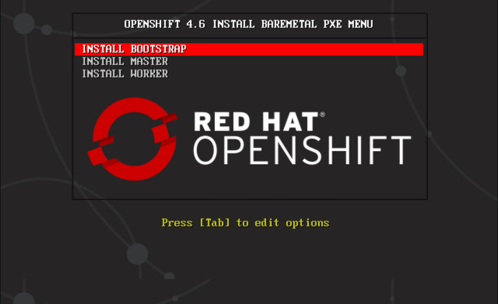
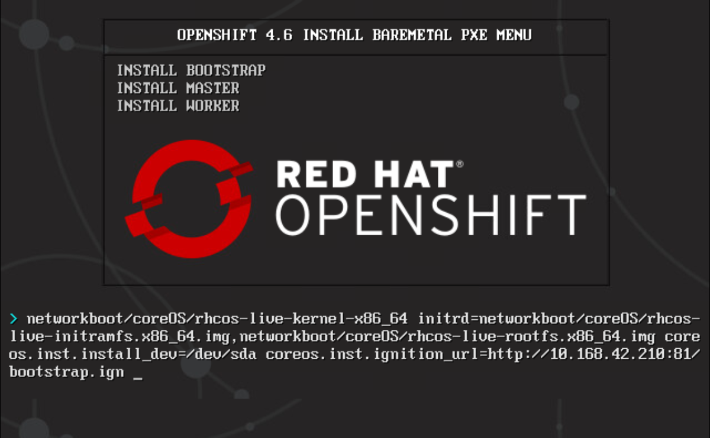

# Openshift 4.6 PXE Boot Menu


### Copy vesamenu.c32
````bash
$ cp /usr/share/syslinux/vesamenu.c32 /var/lib/tftpboot/
````


### Create file /var/lib/tftpboot/pxelinux.cfg/default
```ìni
UI vesamenu.c32
MENU BACKGROUND bg-ocp.png
MENU COLOR sel         4  #ffffff std
MENU COLOR title       0  #ffffff
TIMEOUT 120
PROMPT 0
MENU TITLE OPENSHIFT 4.6 INSTALL BAREMETAL PXE MENU
LABEL INSTALL BOOTSTRAP
  KERNEL networkboot/coreOS/rhcos-live-kernel-x86_64
  APPEND initrd=networkboot/coreOS/rhcos-live-initramfs.x86_64.img,networkboot/coreOS/rhcos-live-rootfs.x86_64.img coreos.inst.install_dev=/dev/sda coreos.inst.ignition_url=http://{{ HTTP SERVER ADDRESS }}:80/bootstrap.ign

LABEL INSTALL MASTER
  KERNEL networkboot/coreOS/rhcos-live-kernel-x86_64
  APPEND initrd=networkboot/coreOS/rhcos-live-initramfs.x86_64.img,networkboot/coreOS/rhcos-live-rootfs.x86_64.img coreos.inst.install_dev=/dev/sda coreos.inst.ignition_url=http://{{ HTTP SERVER ADDRESS }}:80/master.ign

LABEL INSTALL WORKER
  KERNEL networkboot/coreOS/rhcos-live-kernel-x86_64
  APPEND initrd=networkboot/coreOS/rhcos-live-initramfs.x86_64.img,networkboot/coreOS/rhcos-live-rootfs.x86_64.img coreos.inst.install_dev=/dev/sda coreos.inst.ignition_url=http://{{ HTTP SERVER ADDRESS }}:80/worker.ign

````


### After start the server, we can see this boot menu in console



### After press tab to edit, we can see the options
